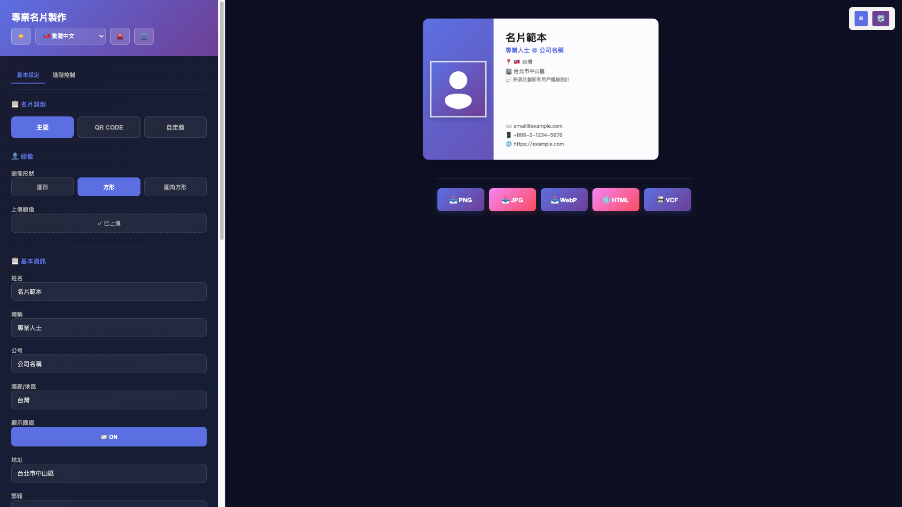
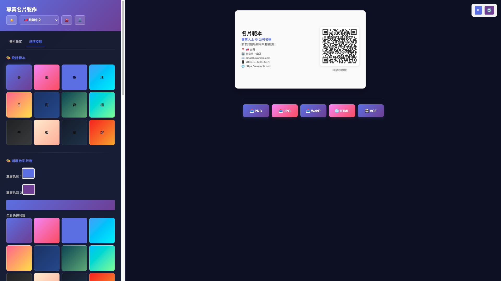
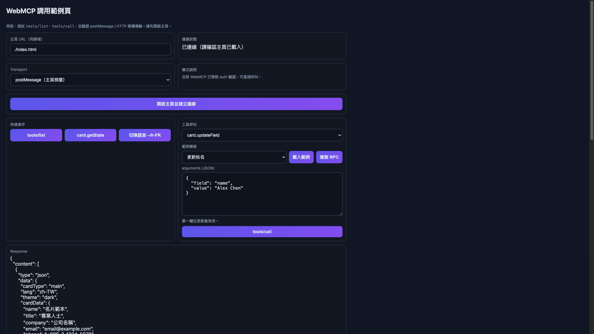

# 個人化名片製作網頁

一個功能完整的個人化名片製作工具，可在 GitHub Pages 上使用。

## Project Demo
- 主畫面: 
  - https://lian0123.github.io/virtual-business-card-project/
- WebMCP: 
  - https://lian0123.github.io/virtual-business-card-project/webmcp-example.html

## Project Photo




## 📚 快速導航

👉 **[5 分鐘快速入門 →](docs/QUICKSTART.md)** | **[常見問題 →](docs/FAQ.md)** | **[功能詳情 →](docs/FEATURES.md)** | **[瀏覽器相容性 →](docs/BROWSER_COMPATIBILITY.md)**

## 🎯 三步開始

```bash
# 1️⃣ 打開應用
./start.sh              # macOS/Linux
# 或 start.bat         # Windows

# 2️⃣ 填寫資訊並預覽
# 在瀏覽器中編輯你的名片

# 3️⃣ 導出並分享
# 下載 PNG、HTML 或 VCF 格式
```

### 預設配置
- 🎨 **預設字體** - Noto Sans（Google 開源字體，完全免費）
- ✨ **預設動畫** - 脈動效果（溫和優雅）
- 🎭 **預設主題** - 明亮主題

👉 **[5 分鐘快速入門指南 →](QUICKSTART.md)**

## ✨ 功能特性

### 名片類型
- **主要名片** - 展示頭像和基本資訊
- **QR CODE 名片** - 包含可掃描的聯絡資訊 QR 碼
- **自定義名片** - 貼圖文字風格的個性化設計

### 可自訂元素
- 自定義大頭照
- 個人姓名
- 國家/地區
- 職稱
- 任職企業名稱
- 聯絡資訊（電子郵件、電話、地址）
- Website 或社群媒體連結
- 一段自我介紹
- 背景圖片
- 可選字體

### 導出功能
- **📸 下載圖片** - 將名片導出為 PNG 圖片檔案
- **🌐 下載 HTML** - 導出為獨立 HTML iframe 檔案
- **📱 下載 VCF** - 導出為標準通訊錄格式

### 主題支援
- ☀️ 明亮主題（預設）
- 🌙 暗色主題
- 即時切換，無需重新加載

### 字體選擇
- **Noto Sans**（推薦，預設）- Google 開源字體，支援多語言
- Arial - 標準無襯線字體
- Times New Roman - 經典襯線字體
- Georgia - 高質感襯線字體
- Courier New - 等寬字體

## 🚀 快速開始

### 三步開始使用

**第 1 步: 打開應用**
```bash
# 方法 A: 直接打開
open index.html              # macOS
start index.html             # Windows

# 方法 B: 使用啟動指令碼
./start.sh                   # macOS/Linux
start.bat                    # Windows
```

**第 2 步: 填寫資訊**
在左側面板輸入你的詳細資訊，右側即時預覽效果

**第 3 步: 導出名片**
- 📸 下載圖片 (PNG)
- 🌐 下載 HTML
- 📱 下載 VCF

👉 **詳細說明**: [快速入門指南 →](docs/QUICKSTART.md)

## 技術棧
- React 18 (CDN 版本)
- HTML5 Canvas
- FileSaver.js (檔案下載)
- html2canvas (將 DOM 轉換為圖片)
- QRCode.js (QR 碼生成)
- Babel (JSX 轉譯)

## 項目結構
```
virtual-card-project/
├── index.html          # 主應用檔案
├── package.json        # 項目配置
├── README.md          # 本說明文件
└── ref.png            # 設計參考圖
```

## 特點
- ✅ 完全響應式設計
- ✅ 無需後端伺服器
- ✅ 支援深色/淺色主題
- ✅ 完整的本地化介面（繁體中文）
- ✅ 高品質的導出功能
- ✅ 簡單易用的介面
- ✅ 支援 GitHub Pages 部署

## 部署到 GitHub Pages

1. 在 GitHub 建立新倉庫 `your-username.github.io`
2. 克隆倉庫到本地
3. 將 `index.html` 和相關文件複製到倉庫
4. 提交並推送：
   ```bash
   git add .
   git commit -m "Add virtual card maker"
   git push origin main
   ```
5. 訪問 `https://your-username.github.io`

## 自訂說明

編輯 `index.html` 中的預設數據，修改以下部分：
```javascript
const [cardData, setCardData] = useState({
    name: '你的名字',
    country: '你的國家',
    // ... 其他字段
});
```

## 瀏覽器相容性
- Chrome 90+
- Firefox 88+
- Safari 14+
- Edge 90+

## 授權
MIT License

### 開源字體
本工具採用 **Google Noto Sans CJK SC** 作為預設字體，該字體遵循 OFL 1.1 授權。所有使用的字體均為開源或系統內建字體，無任何法律風險。

## 更新日誌
- v2.0.0 (2026-02-16) - 優化預設設定（動畫改為脈動、字體改為 Noto Sans、移除有法律疑慮的字體）
- v1.0.0 (2026-02-01) - 初始發佈
